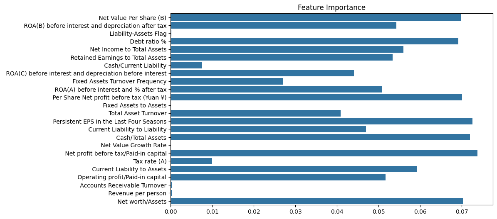

## Overview

The **Bankruptcy Prediction ML** project aims to develop a machine learning pipeline to predict company bankruptcy based on financial indicators. This project leverages various data preprocessing techniques, feature selection algorithms, and machine learning models to achieve accurate and interpretable predictions.

---

## Features

- **Preprocessing**: Handling missing values, encoding categorical variables, and scaling numerical features.
- **Feature Selection**: Identifying key financial metrics using:
  - Correlation analysis
  - Chi-Squared test
  - Recursive Feature Elimination (RFE)
- **Model Comparison**: Evaluating three machine learning models:
  - Random Forest
  - Support Vector Machine (SVM)
  - K-Nearest Neighbors (KNN)
- **Model Finalization**: Selecting the best model based on accuracy and other performance metrics.
- **Insights**: Visualizing feature importance and interpreting key financial indicators.

---

## Results

### **Model Performance**
The models were evaluated on accuracy, precision, recall, and F1-score. Below are the results:

| Model                | Accuracy | Precision (Class 1) | Recall (Class 1) | F1-Score (Class 1) |
|----------------------|----------|---------------------|------------------|-------------------|
| Random Forest        | **97%**  | 0.85                | 0.22             | 0.34              |
| Support Vector Machine | 96%    | 0.75                | 0.06             | 0.11              |
| K-Nearest Neighbors  | 96%      | 0.50                | 0.27             | 0.35              |

- **Best Model**: Random Forest achieved the highest accuracy and balanced performance metrics.

### **Feature Importance**
The Random Forest model provided insights into the most critical financial indicators contributing to bankruptcy prediction. The top features include:
- **Retained Earnings to Total Assets**
- **Net Profit Before Tax / Paid-in Capital**
- **Quick Ratio**

---

## Project Structure

```
Bankruptcy-Prediction-ML/
├── data/                   # Folder for datasets
│   ├── raw_data.csv        # Original dataset
│   ├── processed_data.csv  # Preprocessed dataset
├── notebooks/              # Jupyter notebooks for exploratory work
│   ├── 01_data_exploration.ipynb
│   ├── 02_data_preprocessing.ipynb
│   ├── 03_feature_selection.ipynb
│   ├── 04_model_training.ipynb
├── src/                    # Reusable scripts for preprocessing, feature selection, and model training
│   ├── preprocess.py
│   ├── feature_selection.py
│   ├── train_models.py
├── results/                # Folder for results and visualizations
│   ├── feature_importance.png
│   ├── model_comparison.csv
├── README.md               # Project overview and instructions
├── requirements.txt        # Python dependencies
├── LICENSE                 # License file
├── .gitignore              # Files to ignore in the repository
└── main.py                 # Script to run the full pipeline
```

---

## Usage

### **1. Clone the Repository**
```bash
git clone https://github.com/TharushaSachinthana/Bankruptcy-Prediction-ML.git
cd Bankruptcy-Prediction-ML
```

### **2. Install Dependencies**
Create a virtual environment and install the required Python libraries:
```bash
python -m venv venv
source venv/bin/activate  # On Windows: venv\Scripts\activate
pip install -r requirements.txt
```

### **3. Add the Dataset**
Place the original dataset (`raw_data.csv`) in the `data/` directory.

### **4. Run the Pipeline**
Execute the entire pipeline from preprocessing to model evaluation:
```bash
python main.py
```

---

## How It Works

### **Data Preprocessing**
- Missing values were imputed for both numerical and categorical features.
- Categorical columns were encoded using label encoding.
- Numerical columns were scaled using `StandardScaler`.

### **Feature Selection**
- Features were selected using three methods:
  1. **Correlation Analysis**: Identified features highly correlated with the target variable.
  2. **Chi-Squared Test**: Selected features with the highest dependency on the target.
  3. **Recursive Feature Elimination (RFE)**: Iteratively removed the least important features using Logistic Regression.

### **Model Training**
- Trained three models: Random Forest, SVM, and KNN.
- Evaluated each model on a hold-out test set using accuracy, precision, recall, and F1-score.

### **Model Finalization**
- Random Forest was selected as the final model due to its superior performance.
- The model was saved as `best_model.pkl` for future use.

---

## Results and Insights

1. **Key Features Identified**:
   - Retained Earnings to Total Assets
   - Quick Ratio
   - Net Profit Before Tax / Paid-in Capital

2. **Random Forest Feature Importance**:


3. **Model Comparison**:
   - Random Forest outperformed SVM and KNN in accuracy and overall metrics.
   - Recall and F1-score for the minority class (`Bankrupt? = 1`) highlight the challenge of handling imbalanced datasets.

---

## Limitations and Future Work

### **Limitations**
- The dataset is imbalanced, leading to low recall for the minority class.
- Performance may vary on other datasets with different financial indicators.

### **Future Work**
- Apply techniques like oversampling (SMOTE) or class weighting to handle imbalance.
- Perform hyperparameter tuning for the Random Forest model.
- Explore additional ensemble methods to boost performance.

---

## License

This project is licensed under the MIT License. See the `LICENSE` file for details.

---

## Acknowledgments

- Thanks to UCI Machine Learning Repository for providing the financial dataset.
- Special thanks to the contributors and reviewers for making this project a success.


